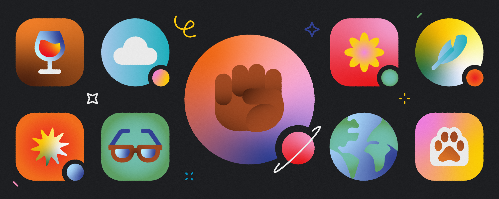

## Hello World, I'm Mireya Elisse 

#### I am currently graphic Web and Design enthusiast focusing on the tools used in front end development such as **HTML5**, **CSS3**, and **JAVASCRIPT**.

:mailbox: Reach out to me!

&nbsp;&nbsp;&nbsp;

### _Languages and Tools_:

&nbsp;&nbsp;&nbsp;&nbsp;&nbsp;&nbsp;&nbsp;&nbsp;
&nbsp;&nbsp;&nbsp;
